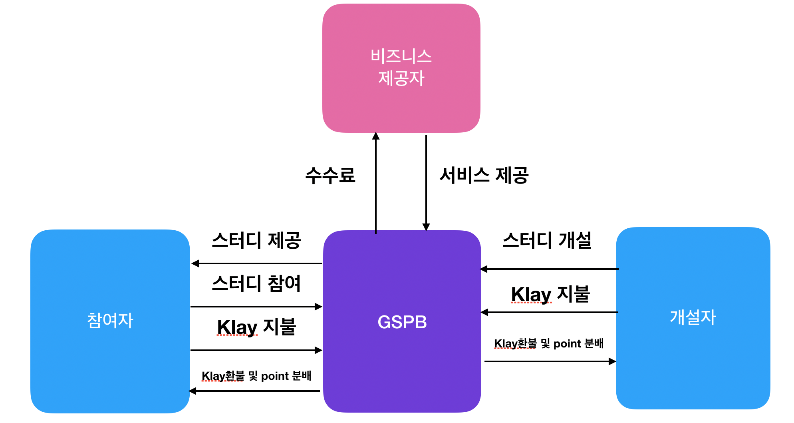

# 403LAB

Group Study Platform App
-----------------

### 1. Project Summary

Both in the online and offline communities, there are countless group studies going on globally. In Korea, especially, there are many group studies on language, certificates and programming. We organized the Group Study Platform, BApp. GSPB(Group Study Platform BApp) encourages quality group studies through the blockchain Klaytn and awards good students to motivate them. The studies can be sustained better through this platform, and it provides a healthy environment for group studies by motivating good students to join new studies and taking measures on bad students. 

### 2. What is Trying to be Solved Through Blockchain?

Cons of Group Studies
1) There cannot be complete control over participation. No restrictions for the participants. 

=> Reports on the studies are registered and managed on blockchain, and when the results are insufficient, the control over the studies is reduced through restrictions from the voting system (expel or reduce voting rights).

2) No reviews on the studies. Management over output

=> Evaluation on the study is conducted by the platform users, and evaluation is sectioned by participation rate. Moreover, the output is saved on blockchain to be managed transparently, and control over the studies is increased and retained through the evaluations. 

3) Necessity of central manager, Reward for central manager

=> By awarding the manager who maintains and manages the studies, the control over the platform is increased so that evaluation for other studies can be conducted more conveniently.

4) Lack of systematic management of the studies and trustworthy ecosystem

=> Using the public, open-access blockchain accounts, trust is earned and systematic management is possible. 

### 3. Main Features of the Service

1) The GSPB users open new studies and participate to create an ecosystem. 

2) Through evaluation and reward of the studies and users, control over GSPB is provided.

3) According to how much control a GSPB user has, the rewards for the studies are reduced or increased and the main studies can be maintained. 

4) Records of the study participants can be read through the public accounts and therefore secure transparency. 

5) The records and outputs of the studies and participants can be managed and read.

### 4. Smart contract
When a user creates, participates or evaluates a group study, one can be applied through the smart contract.

### 5-1. Explain the business model (if existent). 

The business model of GSPB is as follows. To participate in GSPB's group study, one needs a certain amount of tokens. According to their participation rate in the group study, the collected tokens are redistributed. The blockchain networks takes part of the interest fee, and the top participants take the profit. 

### 5-2. What is the expected outcome?

To participate in various studies and have control, the participants need tokens. More tokens are needed, and more activities will follow. Through this system, each group studies and the GSPB ecosystem will be more active, and the tokens will circulate more.

Thank you!

동영상 링크 : https://mijuhome.duckdns.org/sharing/fVQmFVoad

컨트랙 주소 : 0x3a986ed374b91e5d7ca74cd2135a130b158885b6
@klaytnhackathon
